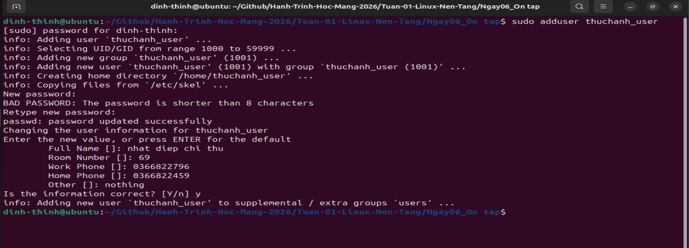
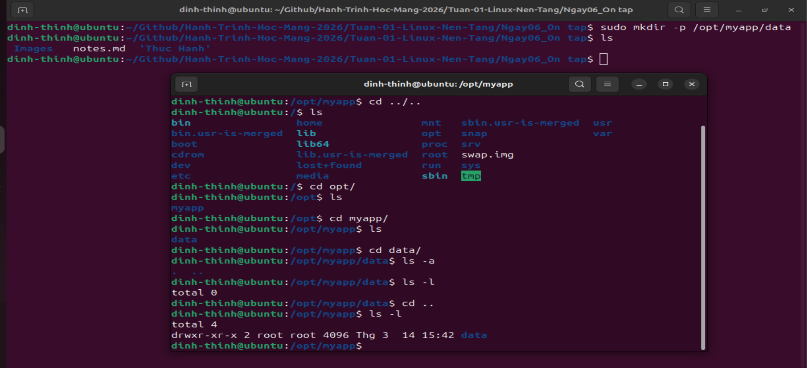
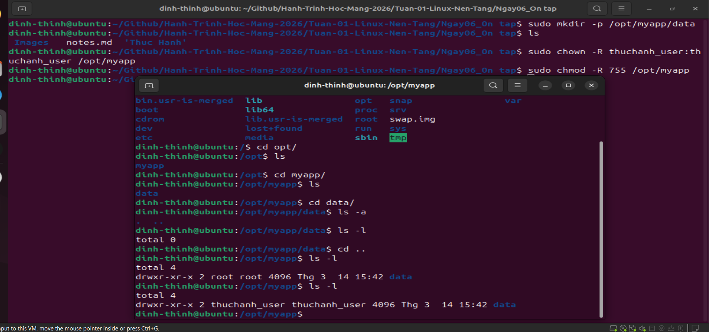
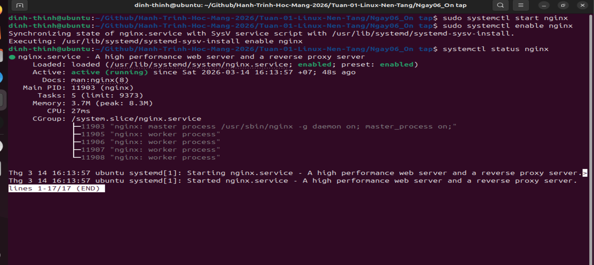
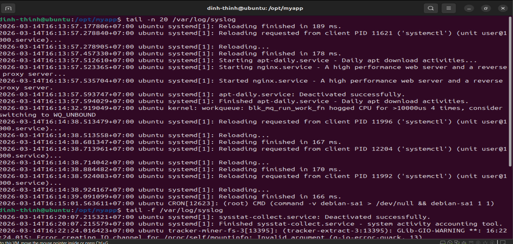
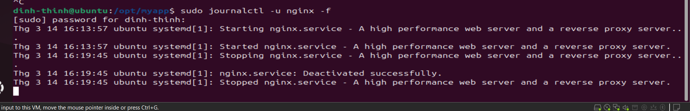

# 🐧 Ngày 6: Thực hành tổng hợp Linux

| **Mục tiêu:** Thực hành quy trình quản trị hệ thống từ tạo User, phân quyền đến vận hành Service và kiểm tra Log.

## 1. Bảng tóm tắt các lệnh (Cheat Sheet)

| Lệnh                | Mô tả                 | Ví dụ                             |
| ------------------- | --------------------- | --------------------------------- |
| `adduser`           | Tạo người dùng mới    | `sudo adduser thuchanh_user`      |
| `mkdir`             | Tạo thư mục làm việc  | `sudo mkdir -p /opt/myapp/data`   |
| `chown`             | Thay đổi quyền sở hữu | `sudo chown -R user:group folder` |
| `chmod`             | Phân quyền truy cập   | `sudo chmod -R 755 folder`        |
| `systemctl`         | Quản lý dịch vụ       | `sudo systemctl start nginx`      |
| `tail`/`journalctl` | Kiểm tra Log hệ thống | `tail -f /var/log/syslog`         |

---

## 2. Các điểm cần lưu ý (Key Points)

* **Quyền hạn:** Luôn sử dụng `sudo` cho các lệnh can thiệp vào hệ thống và thư mục gốc `/`.
* **Phân quyền:** Quyền `755` giúp chủ sở hữu có toàn quyền, trong khi nhóm và người dùng khác chỉ có quyền đọc/thực thi.
* **Theo dõi Log:** Lệnh `tail -f` là cách tốt nhất để theo dõi các sự cố xảy ra trong thời gian thực.

---

## 3. Nội dung thực hành (Lab Steps)

### 1. Quản lý Người dùng (User Management)

Tạo một user mới để thực hành hệ thống:

```bash
sudo adduser thuchanh_user
# Nhập mật khẩu và thông tin cơ bản khi được yêu cầu
```



### 2. Tạo cấu trúc thư mục làm việc:

```bash
sudo mkdir -p /opt/myapp/data
```



### 3. Phân quyền (Permissions)

Gán quyền sở hữu cho user vừa tạo và thiết lập quyền truy cập:

```bash
# Đổi chủ sở hữu thư mục
sudo chown -R thuchanh_user:thuchanh_user /opt/myapp

# Phân quyền: Chủ sở hữu toàn quyền, nhóm/khác chỉ được đọc và truy cập
sudo chmod -R 755 /opt/myapp
```



#### With user (thuchanh):


### 4. Quản lý Dịch vụ (Service Management)

Thực hành khởi chạy và kích hoạt một dịch vụ (Ví dụ: Nginx):

```bash
# Khởi chạy dịch vụ
sudo systemctl start nginx

# Cho phép dịch vụ tự khởi động cùng hệ thống
sudo systemctl enable nginx

# Kiểm tra trạng thái dịch vụ
systemctl status nginx
```




### 5. Kiểm tra Log hệ thống

Theo dõi các hoạt động của hệ thống và dịch vụ để xử lý sự cố:

```bash
# Xem 20 dòng cuối của log hệ thống
tail -n 20 /var/log/syslog

# Theo dõi log thời gian thực (Real-time)
tail -f /var/log/syslog

# Xem log cụ thể của dịch vụ nginx qua journalctl
sudo journalctl -u nginx -f
```




