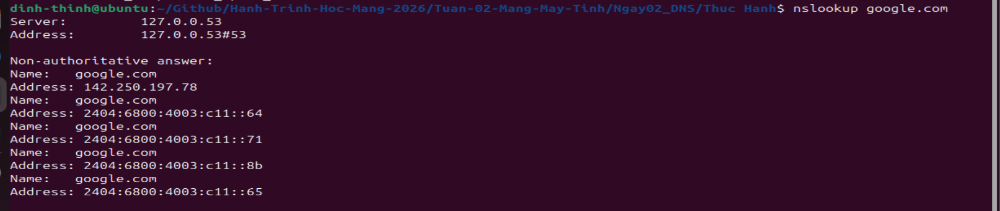
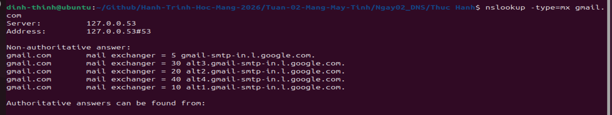
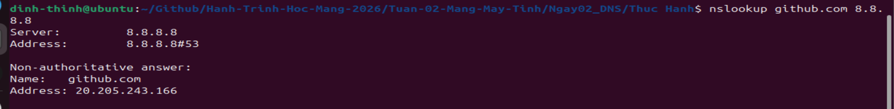

# 🌐 Ngày 2: Hệ thống phân giải tên miền (DNS)

> **Mục tiêu:** Hiểu cơ chế phân giải tên miền và cách truy vấn các loại bản ghi DNS quan trọng bằng `nslookup`.

### 1. DNS là gì? (Domain Name System)

* **Vai trò:** Giống như "Danh bạ điện thoại", biến tên miền (google.com) thành địa chỉ IP (142.250.190.78).
* **Thứ tự kiểm tra:** **File `hosts` trên máy** (Ưu tiên cao nhất, có thể dùng để chặn web) → **Bộ nhớ Cache** (Tăng tốc) → Hỏi DNS Server (Khi không có dữ liệu sẵn như 8.8.8.8).
* **Cấu trúc phân cấp:** Gốc (Root) `.` → Đuôi (TLD) `.com, .vn` → Máy chủ quản lý tên miền (Authoritative Server).

### 2. Các loại bản ghi (Record) cần nhớ

Trong Security và Quản trị mạng, bạn cần biết ít nhất 3 loại này:

* **A Record:** Trỏ tên miền về **IPv4** (phổ biến nhất).
* **CNAME (Canonical Name):** Tên miền bí danh (tên này trỏ về tên kia).
* **MX Record (Mail Exchange):** Chỉ định server xử lý **Email** (quan trọng khi làm bảo mật hệ thống email).

### 3. Sử dụng lệnh `nslookup` thực tế

* **Tra cứu IP (A Record):** `nslookup google.com`
  
  

* **Để tra cứu các loại bản ghi cụ thể**, ta sử dụng tham số `-type=[loại]`. 
  
  - Dưới đây là bảng tra cứu:
  
  | Loại (Type) | Ý nghĩa            | Mục đích sử dụng                                   |
  | ----------- | ------------------ | -------------------------------------------------- |
  | **`a`**     | Address            | Tra cứu địa chỉ **IPv4** (mặc định).               |
  | **`aaaa`**  | IPv6 Address       | Tra cứu địa chỉ **IPv6**.                          |
  | **`mx`**    | Mail Exchanger     | Tìm máy chủ xử lý **Email**.                       |
  | **`ns`**    | Name Server        | Xem **máy chủ DNS** đang quản lý tên miền.         |
  | **`cname`** | Canonical Name     | Tìm tên miền gốc của một **bí danh** (alias).      |
  | **`txt`**   | Text Record        | Chứa thông tin văn bản (xác thực, chống spam).     |
  | **`soa`**   | Start of Authority | Xem thông tin **quản trị** (serial, refresh time). |
  | **`ptr`**   | Pointer            | Tra ngược từ **IP sang Tên miền**.                 |
  | **`any`**   | Any                | Trả về **tất cả** các bản ghi (hay bị chặn).       |
  
  - **Tra cứu Mail Server (MX Record):** `nslookup -type=mx google.com`
    
    

* **Tra cứu bằng Server cụ thể:** `nslookup google.com 8.8.8.8` (hỏi thẳng Google thay vì dùng DNS mặc định).
  
  

### 4. Thực hành Lab (Ghi vào file)

Thực hiện các lệnh sau để lưu kết quả vào cấu trúc thư mục của bạn:

```bash
# 1. Tra cứu IP của Google
nslookup google.com > Network_Lab/Branch_A/dns_check.txt

# 2. Tra cứu Mail Server của một tên miền (ví dụ gmail.com)
nslookup -type=mx gmail.com >> Network_Lab/Branch_A/dns_check.txt

# 3. Tra cứu bằng DNS Google (8.8.8.8) để đối chiếu
nslookup github.com 8.8.8.8 >> Network_Lab/Branch_A/dns_check.txt
```

---

**Trạng thái tiến độ:**

- [x] Hiểu DNS là bộ máy "phiên dịch" theo phân cấp.
- [x] Phân biệt được bản ghi A (IP) và MX (Email).
- [x] Sử dụng thành thạo `nslookup` với các tùy chọn `-type`.
- [x] Lưu kết quả tra cứu vào file thực hành.
